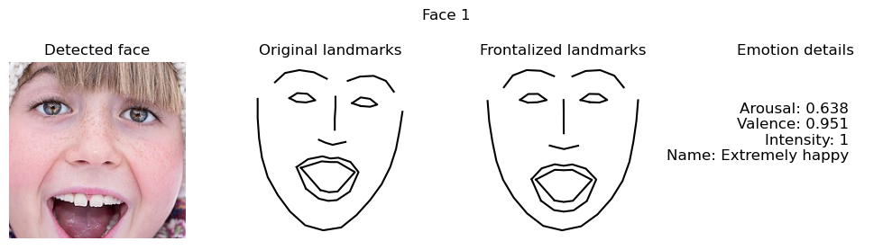
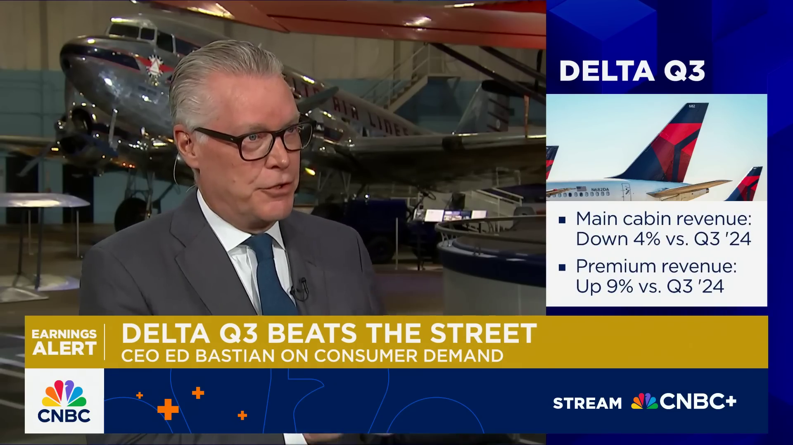

# Facial Expressions as a Modality for Financial Market Forecasting

This project explores whether CEO facial expressions during earnings calls and interviews carry predictive signal for short-horizon stock returns. It combines two complementary tracks:

- A classical, DLIB‑based emotion estimator that extracts arousal, valence, and intensity from facial landmarks.
- A Vision‑Language Model (VLM) demo that scores sparse video frames with a modern VLM, aggregates affect features, and pairs them with price data for directional predictions.






**Authors**
- Vipul Vijay Ramtekkar — vipul.ramtekkar16@gmail.com
- Meetal Manke — meetalmanke2408@gmail.com


**Repository Structure**
- `source/` — DLIB‑based emotion estimation, feature extraction, and utilities.
- `models/` — Required models: DLIB 68‑pt predictor, frontalization weights, pretrained emotion regressor.
- `vlm-demo/` — Self‑contained VLM pipeline (frame extraction, VLM scoring, feature engineering, labeling, CLI + Streamlit app).
- `results/` — Example outputs and plots from experiments.
- `notebooks/` — Exploratory notebooks and walkthroughs.


**Quick Start**
- Emotion Estimation (DLIB)
  - `./install_env.sh` to build a local Python 3.6 env with pinned deps.
  - `source activate_env.sh` to activate it (sets `PYTHONPATH` to `source/`).
  - Ensure `models/` contains:
    - `shape_predictor_68_face_landmarks.dat`
    - `model_frontalization.npy`
    - `model_emotion_*.joblib`
  - Run on a video and write per‑frame estimates:
    ```bash
    python source/process_video_emotions.py \
      --video data/videos/your_clip.mp4 \
      --output results/emotions_your_clip.csv \
      --frame-step 5 \
      --drop-missing
    ```

- VLM Demo
  - `cd vlm-demo && pip install -r requirements.txt`
  - Create `.env` with `OPENROUTER_API_KEY=...` and optional `VLM_MODEL_ID`.
  - Prepare inputs: drop the interview `MP4` under `vlm-demo/data/videos/` and a matching minute bars CSV under `vlm-demo/data/prices/` (columns: `timestamp,open,high,low,close,volume`).
  - Run the end‑to‑end CLI:
    ```bash
    python -m src.demo \
      --ticker DAL \
      --video data/videos/dal_ceo_clip.mp4 \
      --frames-dir data/frames/dal_clip \
      --bars data/prices/DAL_1min.csv \
      --event-time 2024-05-10T14:30:00 \
      --t-start 0 --t-end 210 \
      --frame-stride 30 \
      --horizons 5 60
    ```
  - Optional dashboard:
    ```bash
    streamlit run src/app.py
    ```


**Sample Outputs**
- Emotion Estimation
  - Example plot: `plots/emotion_face_1.png` (above).
  - Example CSV head (from `process_video_emotions.py`):
    ```
    frame_index,timestamp_sec,detected,arousal,valence,intensity,emotion_label
    0,0.00,True,0.124,-0.052,0.135,Slightly tensed
    5,0.17,True,0.211,0.083,0.227,Slightly excited
    10,0.33,False,,,,
    ```

- VLM Demo
  - Sample prediction line printed by `src/demo.py`:
    ```
    DAL | 5m -> ↑ (p=0.64) | holdout acc=0.58
    DAL | 60m -> ↓ (p=0.42) | holdout acc=0.55
    ```
  - Example horizon plot from experiments: `results/DA_1.png`.


**Reproducibility & Environments**
- The DLIB track uses Python 3.6 and scikit‑learn 0.23.x (for model compatibility). The provided `install_env.sh` compiles a local CPython and creates an isolated venv; `activate_env.sh` activates it.
- The VLM track targets Python 3.9+ and installs standard wheels from `vlm-demo/requirements.txt`.


**Acknowledgements**
- The DLIB‑based emotion estimation and landmark frontalization build upon the work of Vasileios Vonikakis and collaborators. Portions of `source/` and the pretrained models are adapted from their public code and papers. Please see the citations below and the original repository for details.
- The VLM demo uses OpenRouter’s Chat Completions API to access vision‑language models; see `vlm-demo/src/openrouter_vlm.py`.
- This repository also relies on DLIB, OpenCV, NumPy, Pandas, scikit‑learn, and Streamlit.


**Citations**
- V. Vonikakis, D. Neo Yuan Rong, S. Winkler (2021). MorphSet: Augmenting categorical emotion datasets with dimensional affect labels using face morphing. ICIP 2021. https://arxiv.org/abs/2103.02854
- V. Vonikakis, S. Winkler (2021). Efficient Facial Expression Analysis For Dimensional Affect Recognition Using Geometric Features. https://arxiv.org/abs/2106.07817
- V. Vonikakis, S. Winkler (2020). Identity Invariant Facial Landmark Frontalization for Facial Expression Analysis. ICIP 2020. https://stefan.winkler.site/Publications/icip2020a.pdf


**License**
- See `LICENSE` for the license governing this repository. Respect upstream licenses for any third‑party code or models used here.
